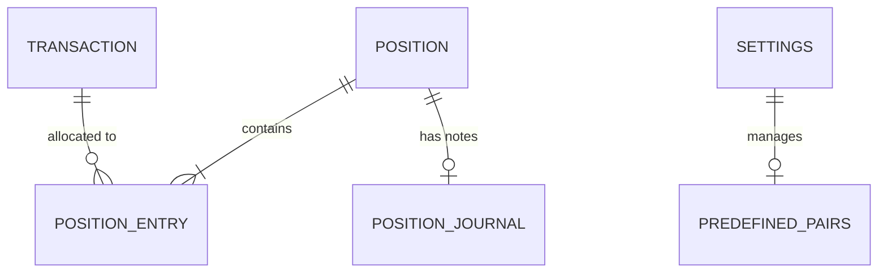

# Technical Architecture

This document describes the design decisions, data models, and architectural patterns used in the CryptoFolio project.

## 1. System Design
CryptoFolio is a **Client-side only** Single Page Application (SPA). 
- **Zero Backend**: No server-side database or API required for core functionality.
- **Privacy & Security**: All user data (transactions, positions) is stored locally in the user's browser.
- **High Performance**: Built with Vite and React for a fast, responsive experience.

## 2. Technology Stack
- **Frontend Framework**: React 19
- **Build Tool**: Vite
- **Language**: TypeScript
- **State Management**: Zustand (lightweight, minimal boilerplate)
- **Persistent Storage**: IndexedDB (via **Dexie.js**)
  - *Why IndexedDB?* Financial data can grow to thousands of records. IndexedDB provides better performance and storage capacity compared to `localStorage`.
- **Styling**: Tailwind CSS + Shadcn/UI
- **Charts**: Recharts (for performance visualization)

## 3. Core Data Models

### Transaction
Records specific buy or sell actions.
```typescript
interface Transaction {
  id: string; // UUID
  date: number; // Unix timestamp (ms)
  symbol: string; // e.g., "BTC/USDT"
  type: "BUY" | "SELL";
  price: number;
  quantity: number;
  amount: number; // total = price * quantity
  fee: number;
  associatedPositionIds: string[]; // Links to Positions
}
```

### Position
Aggregates transactions into a strategy/trade band.
```typescript
interface Position {
  id: string;
  symbol: string;
  strategyName: string;
  type: 'PRIMARY' | 'SHADOW';
  status: "OPEN" | "CLOSED";
  entries: Array<{
    transactionId: string;
    allocatedAmount: number; // Supports partial allocation
  }>;
}
```

## Data Models (ERD Logic)



- **Relational Integrity**: 
  - Cascading Logic: Transactions are the "source of truth". Deleting a transaction automatically removes its `transactionId` from all associated `Position` entries.
  - Decoupling: Deleting a Position does **not** delete the linked Transactions, allowing for re-allocation.

## Technical Nuances

### 1. The Metric Engine
The calculation logic in `src/lib/metrics.ts` uses a custom math wrapper (`src/lib/math.ts`) to avoid JavaScript floating-point errors.
- **Avg Entry**: Calculated as `Total Investment / Total Quantity` for the specific direction (Long/Short).
- **PNL Calculation**: 
  - `Realized`: `(Selling Price - Buying Price) * Sold Quantity`.
  - `Unrealized`: `(Current Price - Avg Entry) * Remaining Quantity`.

### 2. Price API & Caching
- **Source**: Binance Public API (`ticker/price`).
- **Caching Strategy**: 
  - TTL: 5 minutes (300,000ms).
  - Background Refresh: The `Dashboard` and `PositionDetails` pages trigger background updates for OPEN positions and PINNED pairs.
  - Manual Override: Pull-to-refresh resets the cache timestamp.

### 3. Binance Import Pipeline
- **Regex Parsing**: Fees are extracted from strings (e.g., `0.00123BNB`) using greedy regex matching.
- **Deduplication**: Uses the `OrderId` as the primary key in IndexedDB to prevent double-counting.

## 4. Key Architectural Patterns

### Primary vs. Shadow Positions (Double-Counting Solution)
One of the core challenges in portfolio tracking is visualizing different strategies without double-counting assets in the total balance.
- **PRIMARY Positions**: Represent unique allocations of capital. Global portfolio metrics (Total PnL, ROI) **only** include data from PRIMARY positions.
- **SHADOW Positions**: Used for analysis and "what-if" scenarios. They can reuse transactions already allocated to PRIMARY positions for experimentation.

### Metric Engine
The metrics calculation logic is decoupled from the UI:
- **`lib/math.ts`**: High-precision utility functions using standard JS numbers (future transition to `decimal.js` planned if needed).
- **`lib/metrics.ts`**: Core logic for calculating volume-weighted average price (VWAP), Realized PnL, and ROI.

## 5. Storage Flow
1. **User Input** -> Saved to **Dexie.js** (IndexedDB).
2. **State Sync** -> Zustand stores listen for DB changes or trigger refreshes.
3. **Reactive UI** -> Components re-render based on Zustand state or `useLiveQuery` hooks.
